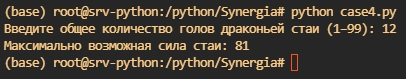

# Учебный проект: Максимальная сила драконьей стаи

# Общая информация
- Учебное заведение: Университет "Синергия"
- Тип проекта: Задание учебной практики (Кейс-задача №4)
- Студент: Нигматуллин Денис Аликович
- Язык программирования: Python

# Условие задачи
Известно, что у каждого дракона есть определённое количество голов.
Сила стаи определяется произведением числа голов всех драконов.
Если у нас есть общее количество голов N, нужно определить, какой максимальной может быть сила стаи, если у одного дракона не может быть более 7 голов.

Входные данные:
Натуральное число N (0 < N < 100) — общее число голов.
Выходные данные:
Максимально возможное значение силы стаи.

# Реализация
- Разделить N на как можно большее количество драконом с 7 головами, остаток распределить оптимально среди оставшихся драконов.
- Вычислить произведение голов каждого дракона.

# Пример работы

